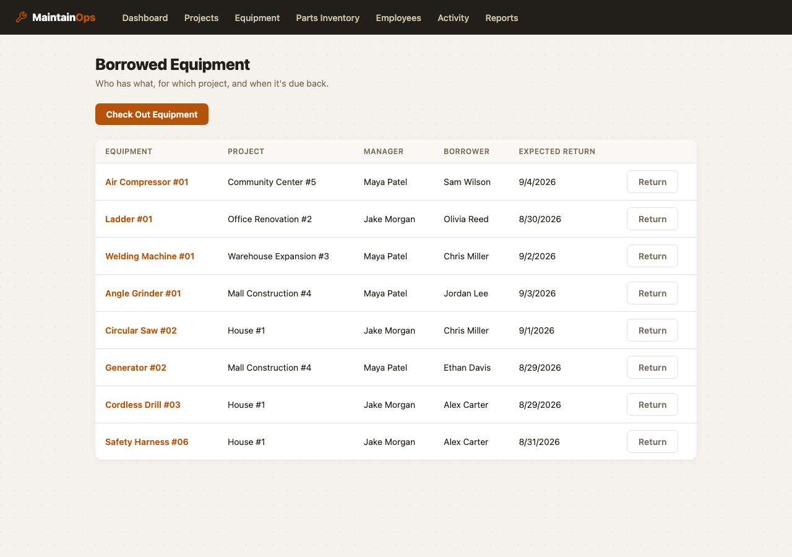
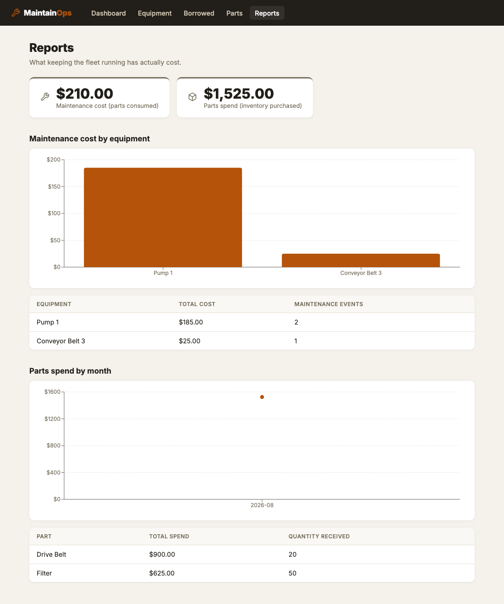

# MaintainOps


## The problem this replaces

Picture a small industrial site — a handful of buildings, forty or so pieces of rotating
equipment, a couple of maintenance techs. Right now, all of it lives in a spreadsheet
someone started years ago. It's on a shared drive, it's called something like
`maintenance_tracker_FINAL_v3.xlsx`, and everyone has a slightly different copy of it open
at any given time. Nobody's entirely sure which tab is current. Parts inventory is a
*separate* spreadsheet, so nobody notices they're out of drive belts until a tech is standing
in front of a conveyor holding a broken one.

That's the actual scenario MaintainOps is built for. Not a hypothetical enterprise CMMS
deployment — one shared tool that answers two questions a shift supervisor actually asks
every morning: *what's overdue, and what are we about to run out of.*


## How it actually gets used

A tech finishes a repair on Pump 1. They open the equipment page on a shop tablet, hit **Log
Maintenance**, type two sentences about what they did, pick the parts they used off a
dropdown (the app already knows how many are in stock), and hit save. That's the entire
interaction. Behind that one click:

- The parts they used get deducted from inventory, and if the storeroom doesn't actually
  have enough of something, the whole log is rejected up front — not partially applied, not
  a silent negative-quantity bug that surfaces three weeks later during a stock count.
- The equipment's maintenance clock resets, based on its usage-hour meter, not the calendar
  date. A pump that runs 40 hours a week and one that runs 140 hours a week wear out on
  completely different schedules; a fixed "every 90 days" reminder is wrong for both of them.
- The dashboard the supervisor checks each morning updates automatically — no separate
  reconciliation step, because there's only one source of truth now.

That "reject the whole thing if a part is short" behavior is worth dwelling on for a second,
because it's the part of this app I spent the most time on and the part most likely to bite
someone in production if it were done carelessly. If a tech logs a job that used 2 filters
and 1 belt, and there's only 1 belt left short of what's needed, you do **not** want the
filters silently deducted and the belt request quietly ignored — that leaves inventory
correct for one part and wrong for the other, and now nobody trusts the numbers at all. So
the whole request is validated against current stock *before* anything is written, and if
anything's short, nothing moves. Multi-part logs really are all-or-nothing.

## Borrowing equipment

The other half of "spreadsheet chaos" isn't maintenance, it's *where is the thing*. A drill
gets thrown in a truck for a job, the truck goes to three more sites that week, and six weeks
later nobody can say whether it's still out, who has it, or whether it even came back to the
right shelf. So checking equipment out is a first-class action, not an afterthought:

> **What are you borrowing:** Safety Harness A
> **For which project:** House Build #123
> **Who's the manager:** Dana
> **Who's borrowing it:** Yusuf
> **Expected return:** 9/4/2026

Hit submit and the equipment's `current_location` moves from *Garage Back Storage 3* to
*House Build #123* immediately — the equipment list, the equipment's own detail page, and the
dashboard all reflect it without anyone touching a spreadsheet. Returning it moves the location
back and closes out the loan.



Two rules make this trustworthy instead of just a log of good intentions:

- **One active loan per piece of equipment, enforced, not just conventionally true.** Trying
  to check out something that's already checked out gets rejected (`409`, with the id of the
  loan that's blocking it) instead of silently creating a second "who has it" record that
  contradicts the first. Two people can't both think they have the only harness.
- **Some equipment wears out from use, not time.** A few pieces of gear (safety harnesses,
  anything with a manufacturer-rated deployment limit) are only good for a fixed number of
  uses. Every checkout counts as one use, and once the count reaches the limit the equipment
  is flagged for discard everywhere — the equipment list, its detail page, and a dedicated
  Dashboard card. It's a flag, not a lock: the gear still checks out fine at the limit, because
  *deciding to actually discard something* is a judgment call for a person holding it in their
  hands, not something software should auto-enforce on a maybe-stale count.

I deliberately kept "manager" and "borrower" as free-text fields rather than building a real
staff directory for this pass — see [What I'd add next](#what-id-add-next-honestly).

## What it costs to keep the fleet running

Stock only ever went one direction in the first version of this app: down, consumed by
maintenance. There was no record of how it came back — no restock log, so nobody could say
when a part was last ordered, from whom, or at what price. And every part already had a
`unit_cost` sitting right there in the database, completely unused for anything except
display. Two features closed both gaps at once.

**Restocking** is a shipment record — quantity received, price paid, supplier, an optional
note — that adds to `quantity_on_hand` and updates the part's current price. Nothing exotic.

**Cost reporting** is what that price actually enables. Every `MaintenanceLog` line item now
snapshots the part's price *at the moment it was consumed* (`unit_cost_at_time`), not a live
reference to the part's current price. That distinction matters: without it, restocking a
part at a higher price next month would silently rewrite the cost of every job that used it
last month. With the snapshot, a `/reports/maintenance-cost` endpoint can roll all of that up
— by equipment, by month — and answer the question a shift supervisor actually has: *which
piece of equipment is costing us the most to keep alive?* A second report,
`/reports/parts-spend`, answers the mirror-image question — what have we spent buying
inventory — using the same snapshot-don't-reference principle on restock records.



The two numbers on that dashboard are deliberately not required to match. Maintenance cost is
what got *consumed*; parts spend is what got *purchased*. You restock ahead of consumption,
so on any given day they're telling you two different, both-true things.

## What I ran into building it, and what I'd tell someone doing this again

**A bug the tests caught, not code review.** Early on, `record_maintenance` created the
maintenance log by setting `equipment_id` directly on the new row instead of going through
SQLAlchemy's relationship (`equipment.maintenance_logs.append(log)`). It worked fine —
right up until I wrote a test for "equipment with no prior history gets serviced for the
first time" and asserted `len(equipment.maintenance_logs) == 1` immediately after the call,
in the same session, without re-querying. It came back `0`. The row was in the database
correctly; SQLAlchemy's in-memory collection on the `equipment` object just didn't know
about it yet, because I'd bypassed the mechanism that keeps that collection in sync. One-line
fix, but it's exactly the kind of bug that's invisible in manual testing (where you almost
always re-fetch after a write) and only shows up when something in the same request needs
the just-written data back immediately — which, for an API that returns the created log with
its equipment relationship still attached, is a real scenario, not a contrived one.

**Decimal, not float, for anything a threshold check compares against.** `usage_hours`
accumulates from repeated small updates over the equipment's whole life, and the overdue
check is an exact `>=` comparison. Floats drift. I don't think it would have caused a visible
bug in a demo — but on real usage data over months, "equipment sits exactly at its 500-hour
interval" is a real state that will occur, and I didn't want the answer to depend on binary
floating-point rounding. Switched `usage_hours`, `last_maintenance_usage_hours`, and
`maintenance_interval_hours` to `Numeric` early rather than debug it later.

**localhost and 127.0.0.1 are different origins.** Spun up the backend and frontend, opened
the browser, and got a wall of CORS errors — because I'd bound the Vite dev server to
`127.0.0.1` while the backend's CORS allowlist said `localhost`. Browsers treat those as two
different origins even though they resolve to the same machine. Easy fix once you know to
look for it, mildly infuriating the first time you don't.

**The stock-check race condition is real but I scoped it down.** Two techs logging
maintenance against the same low-stock part at the same instant could, in theory, both pass
the "is there enough stock" check before either one's write commits — a classic
check-then-act race. `record_maintenance` guards against it with `SELECT ... FOR UPDATE` row
locks on Postgres. I didn't build a concurrency test for it (that would mean spinning up two
real transactions against a real Postgres instance and orchestrating their timing, which is
a legitimate thing to do but is more machinery than this project's test suite currently
carries) — so treat that protection as reasoned-about and code-reviewed, not
test-verified. If this went further, that'd be the first integration test I'd add.

**No `is_checked_out` column, on purpose.** It would've been the obvious first move — a
boolean on `Equipment` that flips on checkout and off on return. I didn't add it, because a
boolean like that is redundant state: the truth is really "does an `EquipmentLoan` row for
this equipment have `returned_at IS NULL`," and the moment you store the same fact twice you've
created a way for them to disagree (a bug, a failed transaction, a manual DB fix that touches
one and not the other). `is_checked_out` in the API response is *computed* from the loan
table on every read instead. Slightly more query work, zero chance of the flag lying to you.

**A deliberate bug-hunt turned up eight real ones.** Once the feature set felt done, I ran a
dedicated review pass across the whole app — four independent reviewers (line-by-line
correctness, API contract mismatches, frontend state/race bugs, cross-cutting cleanup), each
verified against the actual code before I touched anything. Some of what came out of it:

- `record_maintenance` locked the parts in a multi-part log in whatever order the client sent
  them, not a canonical order. Two concurrent logs referencing the same two parts in opposite
  order could deadlock each other on Postgres — a classic lock-ordering bug. Fixed by locking
  in sorted `part_id` order regardless of request order.
- There was no handler for `IntegrityError` anywhere, so a duplicate SKU came back as a raw
  500 — directly contradicting the "always JSON, never a stack trace" error contract I'd
  written into this same README. Chasing that down turned up something worse: deleting a
  part that has maintenance history doesn't raise `IntegrityError` at all. `parts_used.part_id`
  is part of a *composite primary key*, so SQLAlchemy can't null it out the way a normal
  foreign key would on delete — it throws a bare `AssertionError` instead, which no handler
  catches either. The honest fix wasn't a handler, it was a business rule: block deleting a
  part with maintenance history (and, same principle, block deleting equipment that's
  currently checked out), both with a clean 409 instead of a crash either way.
- Half the money and quantity fields in the API had no floor. `PATCH /parts/{id}` with
  `quantity_on_hand: -50` was accepted — silently corrupting every report and low-stock check
  downstream, with none of `logic.py`'s careful validation ever seeing it, because the bad
  value never went through `logic.py` at all.
- `return_equipment` locked the loan row it was closing but not the equipment row it was also
  writing to (`current_location`) — `check_out_equipment` locks that same row before writing
  it. Same gap on both `PATCH` endpoints, which read via a plain unlocked fetch while every
  other mutator of those rows takes a row lock.

None of these showed up in the 41 tests that existed at the time — they're exactly the class
of bug unit tests miss: constraint interactions, lock ordering, and error paths nobody had a
reason to hit on the happy path. Full list of what was found and fixed is in the commit
history from that pass.

**The Reports charts rendered nothing, and it wasn't a data bug.** First pass at the cost
charts used the latest Recharts release. Numbers were correct — the axes scaled to the right
range — but the bars and lines themselves never appeared: empty `<g>` elements in the DOM,
no path or rect inside. Downgrading to Recharts' older stable line changed nothing, which
ruled out a version-specific regression. The actual cause: Recharts mounts a bar or line's
shape through an animated entrance driven by `requestAnimationFrame`, and the environment I
was testing in throttles rAF for a backgrounded/unfocused tab -- so the animation queued and
never advanced, and the shape never mounted. That's not a quirk unique to one dev setup:
every real browser throttles rAF in a tab that isn't focused. A user who opens the Reports
page in a background tab would hit the identical blank chart. Fixed by setting
`isAnimationActive={false}` on both charts -- instant, correct rendering regardless of
whether the tab has focus, at the cost of losing the entrance animation.

## Architecture

```
maintainops/
├── docker-compose.yml
├── backend/
│   ├── app/
│   │   ├── models.py        Equipment, Part, MaintenanceLog, PartUsed, EquipmentLoan,
│   │   │                    PartRestock (SQLAlchemy 2.0)
│   │   ├── logic.py         Mutating business logic -- framework-agnostic, no FastAPI/HTTP
│   │   ├── reports.py       Read-only aggregation: maintenance_cost_report, parts_spend_report
│   │   ├── schemas.py       Pydantic request/response models
│   │   ├── database.py      Engine, session factory, commit-on-success get_db()
│   │   ├── main.py          FastAPI app, CORS, exception -> HTTP status mapping
│   │   └── routers/         equipment.py, equipment_loans.py, parts.py,
│   │                        maintenance_logs.py, alerts.py, reports.py
│   └── tests/test_logic.py  53 tests against the business logic layer
└── frontend/
    └── src/
        ├── api/client.ts     Typed fetch wrapper, one function per endpoint
        ├── types.ts          TypeScript interfaces mirroring the API schemas
        ├── utils.ts          Maintenance-status thresholding, formatting
        ├── components/       MaintenanceStatusBadge, LowStockBadge, WearLimitBadge,
        │                     StatCard, LogMaintenanceForm, CheckOutForm,
        │                     NewEquipmentForm, RestockForm, Toast, EmptyState
        ├── pages/            DashboardPage, EquipmentListPage, EquipmentDetailPage,
        │                     EquipmentLoansPage, PartsPage, ReportsPage
        └── App.tsx           Routing + nav
```

`logic.py` never imports FastAPI. It takes a SQLAlchemy `Session` and plain arguments, and
raises its own exception types (`EquipmentNotFoundError`, `InsufficientStockError`,
`EquipmentAlreadyCheckedOutError`, ...). The router layer's only job is catching those and
mapping them to status codes. That split is why the 53 tests in `test_logic.py` run in under
half a second against SQLite, with zero HTTP machinery involved.

`reports.py` is a deliberate second module, not more functions bundled into `logic.py`:
`logic.py` mutates and never runs a bare aggregate query; `reports.py` reads and never writes.
Splitting them means you can tell which one a new function belongs in just by asking whether
it changes anything.

## The business logic itself

```python
def is_equipment_overdue(equipment: Equipment) -> bool:
    hours_since_service = equipment.usage_hours - equipment.last_maintenance_usage_hours
    return hours_since_service >= equipment.maintenance_interval_hours

def is_part_low_stock(part: Part) -> bool:
    return part.quantity_on_hand <= part.reorder_threshold

def is_equipment_at_wear_limit(equipment: Equipment) -> bool:
    if equipment.max_usage_count is None:
        return False
    return equipment.usage_count >= equipment.max_usage_count

def part_urgency(part: Part) -> Literal["none", "watch", "urgent"]:
    if not is_part_low_stock(part):
        return "none"
    return "urgent" if part.is_critical else "watch"
```

`record_maintenance` does more, in this order:

1. Validates every `parts_used` entry — positive quantity, no part repeated in the same
   request — before touching the database at all.
2. Loads the equipment and every part with `SELECT ... FOR UPDATE` (the race-condition guard
   described above).
3. Checks *all* requested parts against current stock before mutating *any* of them. A
   shortfall on one part out of five aborts the whole log, and the caller gets back exactly
   which part(s) were short and by how much — not a generic "something went wrong."
4. On success: decrements each part's `quantity_on_hand`, creates the `MaintenanceLog` and
   its `PartUsed` rows, and resets `equipment.last_maintenance_usage_hours` to the
   equipment's current `usage_hours`.
5. `flush()`s but never `commit()`s — the FastAPI dependency (`get_db` in `database.py`) owns
   the transaction boundary and commits on success or rolls back on any exception, including
   ones raised deep in a router.

`check_out_equipment` follows the same shape: locks the equipment row (`SELECT ... FOR
UPDATE`), checks for an existing unreturned `EquipmentLoan` on that equipment and rejects if
one exists, then creates the loan, moves `current_location` to the project, and increments
`usage_count`. `return_equipment` locks *both* the loan row and the equipment row (a fix from
the bug-hunt above) before setting `returned_at` and moving `current_location` back to
`location` (the home spot). `restock_part` locks the part row, adds to `quantity_on_hand`, and
updates `unit_cost` to the price just paid. None of these commit, same as `record_maintenance`
-- same transaction-ownership rule throughout the app.

`reports.py`'s two functions are pure reads: `maintenance_cost_report` walks every
`MaintenanceLog`, sums `quantity * unit_cost_at_time` per log, and groups the result by
equipment and by month. `parts_spend_report` does the same over `PartRestock` rows, grouped by
part and by month. Both are plain Python aggregation over ORM objects rather than SQL
`GROUP BY` -- deliberate at this project's scale, since it sidesteps writing aggregate SQL that
only works on one of SQLite (dev) or Postgres (prod).

## API Reference

| Method | Endpoint                     | Description                                              |
| ------ | ----------------------------- | ------------------------------------------------------------ |
| GET    | `/equipment`                  | List all equipment                                            |
| POST   | `/equipment`                  | Create equipment                                                |
| GET    | `/equipment/{id}`             | Get one piece of equipment                                        |
| PATCH  | `/equipment/{id}`             | Partial update                                                    |
| DELETE | `/equipment/{id}`             | Delete                                                              |
| GET    | `/equipment/{id}/history`     | Maintenance logs for this equipment, newest first                    |
| GET    | `/equipment/{id}/loans`       | Borrow history for this equipment, newest first                       |
| POST   | `/equipment/{id}/checkout`    | Borrow it -- project, manager, borrower, expected return                |
| POST   | `/equipment-loans/{id}/return`| Return a loan; moves the equipment back to its home location             |
| GET    | `/equipment-loans`            | All loans; `?active=true` for currently-out only, `?active=false` for returned |
| GET    | `/parts`                      | List all parts                                                       |
| POST   | `/parts`                      | Create a part                                                          |
| GET    | `/parts/{id}`                 | Get one part                                                           |
| PATCH  | `/parts/{id}`                 | Partial update                                                          |
| DELETE | `/parts/{id}`                 | Delete (409 if it has maintenance history)                                |
| POST   | `/parts/{id}/restock`         | Receive a shipment -- quantity, price paid, supplier, notes               |
| GET    | `/parts/{id}/restocks`        | Restock history for this part, newest first                                |
| POST   | `/maintenance-logs`           | Log maintenance, consuming parts and resetting the baseline               |
| GET    | `/alerts/overdue-maintenance` | Equipment currently overdue, with hours-overdue                             |
| GET    | `/alerts/low-stock`           | Parts at or below their reorder threshold, with urgency                      |
| GET    | `/alerts/discard-recommended` | Equipment that has hit its wear-count limit                                   |
| GET    | `/reports/maintenance-cost`   | Cost of parts consumed, by equipment and by month                              |
| GET    | `/reports/parts-spend`        | Cost of parts purchased, by part and by month                                   |

`404` for a missing id. `422` for a value Pydantic itself rejects (negative stock, a zero or
negative maintenance interval, a non-positive quantity). `400` for validation failures that
require checking business state, not just shape (insufficient stock — with a `shortfalls`
array telling you exactly which parts and by how much — or a duplicate part in one request).
`409` for a request that's well-formed but conflicts with the resource's current state:
checking out something already checked out (response includes `active_loan_id`), returning a
loan twice, deleting equipment that's currently checked out, or deleting a part that has
maintenance history. `201` on create, `204` on delete. Errors are always JSON, never a raw
stack trace — including database-constraint violations like a duplicate SKU, which get the
same clean-409 treatment via a generic `IntegrityError` handler.

Swagger UI is at `/docs`, ReDoc at `/redoc` — both work standalone with no frontend running.

## Quick Start

### With Docker (recommended)

```bash
git clone https://github.com/navyathag13-ui/maintainops.git
cd maintainops
docker-compose up --build
```

- Frontend: [http://localhost:5173](http://localhost:5173)
- API + Swagger docs: [http://localhost:8000/docs](http://localhost:8000/docs)
- Postgres: `localhost:5432` (`maintainops` / `maintainops`)

### Running locally without Docker

```bash
# Backend
cd backend
python -m venv .venv && source .venv/bin/activate
pip install -r requirements.txt
# Needs a running Postgres, or point at SQLite for a quick local check:
DATABASE_URL="sqlite:///./dev.db" uvicorn app.main:app --reload

# Backend tests
pytest tests/ -v

# Frontend (separate terminal)
cd frontend
cp .env.example .env
npm install
npm run dev
```

## Testing

`backend/tests/test_logic.py` — 53 cases against the business-logic functions, run against a
fresh in-memory SQLite database per test. Beyond the obvious correct-path cases, it
specifically covers:

- Exactly-at-threshold for the overdue check, the low-stock check, *and* the wear-limit check
  — the spec is `>=`/`<=` throughout, so every boundary needs a test, not just values
  comfortably on either side
- Zero stock, and insufficient stock on one part out of a multi-part request — with an
  assertion that the *other* part's quantity is untouched, proving all-or-nothing actually
  holds
- Zero/negative requested quantity, and the same part listed twice in one request
- Equipment with no prior maintenance history (the bug described above)
- Every cell of the urgency matrix: low-stock × critical, low-stock × not-critical,
  not-low-stock × critical (still "none" — urgency only matters once stock is actually low)
- Checkout while already checked out (rejected), return while already returned (rejected),
  return-then-recheckout (allowed, and counts as a fresh use), a checkout that lands exactly
  on the wear limit (allowed, but flags `is_equipment_at_wear_limit`)
- A maintenance log's cost snapshot matches the part's price at that moment, and stays put
  even after the part's price changes later — the whole point of `unit_cost_at_time`
- Restock validation (zero/negative quantity rejected) and that a restock never touches an
  *existing* log's cost snapshot, only the part's going-forward price
- Both cost reports on empty data (zero, not an error) and on a multi-equipment,
  multi-month scenario, checked against hand-computed totals
- Unknown equipment id / unknown part id / unknown loan id

Business-rule correctness is unit-tested this thoroughly; the bug-hunt findings above (lock
ordering, missing validation, the delete-guard crash) were not caught by this suite -- they're
a different failure class (constraint interactions, concurrency, error-path coverage) that a
business-logic test suite over a single in-memory session structurally can't see. Verified
those by hand against a running server instead; see the commit for exactly what was checked.

## Tech Stack

| Layer         | Choice                                          |
| ------------- | -------------------------------------------------- |
| Backend       | Python 3.11+, FastAPI                                |
| ORM           | SQLAlchemy 2.0 (sync)                                  |
| Database      | PostgreSQL (Docker Compose)                              |
| Backend tests | pytest                                                    |
| Frontend      | React 19 + TypeScript, Vite, React Router                  |
| Charts        | Recharts (pinned to 2.x -- see below)                          |
| Containers    | Docker Compose (Postgres + backend + frontend/nginx)          |
| API docs      | FastAPI's built-in Swagger UI / OpenAPI                          |

## What I'd add next, honestly

- **Auth.** This is currently an open internal tool with no login — fine for a single-site
  pilot behind a VPN, not fine the moment a second site or an external vendor needs access.
- **Alembic migrations.** `create_all()` on startup is the right amount of ceremony for a
  project this size right now, but it can't evolve a schema with existing data in it. That's
  the first thing to swap in the moment this stops being a green-field pilot.
- **Pagination on `/equipment` and `/parts`.** Fine to load everything at once now; won't be
  once a fleet or a catalog gets past a couple hundred rows.
- **A real concurrency test** for the `SELECT ... FOR UPDATE` paths (both the parts-stock one
  and the equipment-checkout one), using two real transactions against Postgres, not just
  code review.
- **Barcode/QR scan on the parts dropdown, and on equipment for checkout.** The manual
  dropdown is fine for a demo; a tech standing at a shelf would rather scan a bin or asset
  label than search a list.
- **Real borrower/manager records instead of free text.** I chose free text deliberately for
  this pass — it's the fastest path to something usable, and it upgrades cleanly later
  (existing loan rows just keep their typed name, new ones can reference a person record). The
  tradeoff is real, though: nothing stops "Yusuf" and "yusuf" and "Yousef" from being three
  different people in the data.
- **A staff/scheduling layer is explicitly not part of this project.** People, time-off, team
  calendars, and company announcements came up as real needs while building this, but they're
  a different data model and a different story than equipment tracking — that's a separate
  project, not a module bolted onto this one.
- **N+1 queries in `alerts.py` and `reports.py`.** Both load a whole table into memory and
  filter/aggregate in Python rather than pushing the work into SQL, and neither eager-loads
  the relationships it touches (`log.equipment`, `log.parts_used`, `r.part`) -- fine at
  today's scale, a real cost once a fleet or a maintenance history gets into the thousands of
  rows. Known, not yet worth the added complexity for a tool this size.
- **Alembic migrations, now doubly true.** The bug-hunt pass added `ge=0`/`gt=0` constraints
  at the Pydantic layer, not the database layer -- a real Postgres `CHECK` constraint would
  close that gap for good (and for any client that isn't this API), but adding one to a table
  that might already have rows is exactly the kind of change `create_all()` can't do safely.
