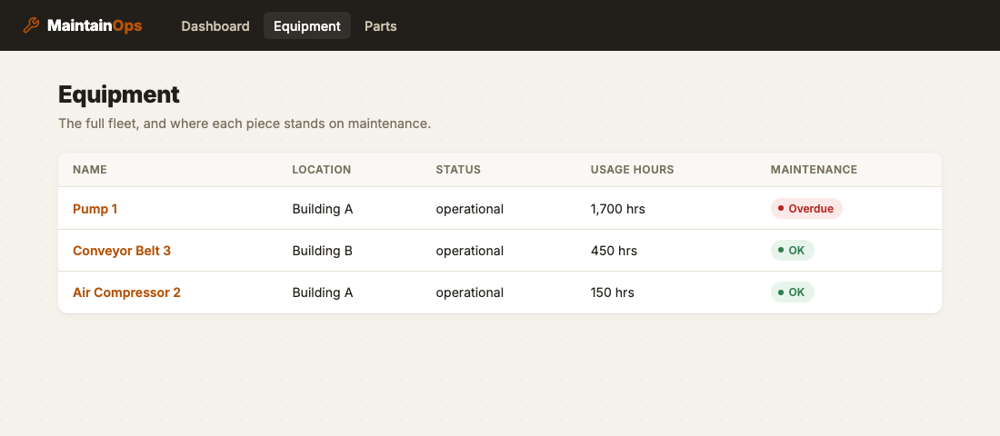
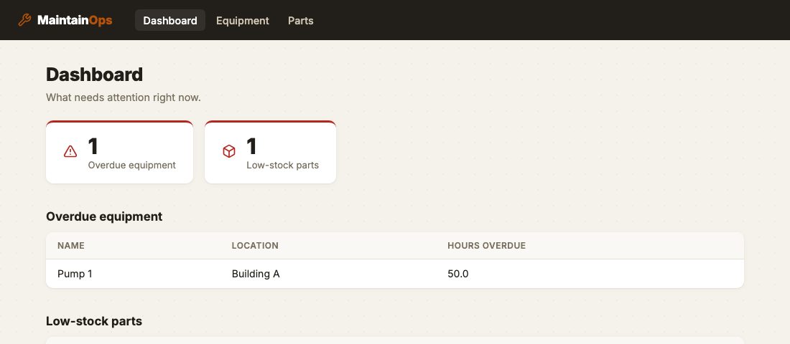

# MaintainOps



## The problem this replaces

Picture a small industrial site — a handful of buildings, forty or so pieces of rotating
equipment, a couple of maintenance techs. Right now, all of it lives in a spreadsheet
someone started years ago. It's on a shared drive, it's called something like
`maintenance_tracker_FINAL_v3.xlsx`, and everyone has a slightly different copy of it open
at any given time. Nobody's entirely sure which tab is current. Parts inventory is a
*separate* spreadsheet, so nobody notices they're out of drive belts until a tech is standing
in front of a conveyor holding a broken one.

That's the actual scenario MaintainOps is built for. Not a hypothetical enterprise CMMS
deployment — one shared tool that answers two questions a shift supervisor actually asks
every morning: *what's overdue, and what are we about to run out of.*



## How it actually gets used

A tech finishes a repair on Pump 1. They open the equipment page on a shop tablet, hit **Log
Maintenance**, type two sentences about what they did, pick the parts they used off a
dropdown (the app already knows how many are in stock), and hit save. That's the entire
interaction. Behind that one click:

- The parts they used get deducted from inventory, and if the storeroom doesn't actually
  have enough of something, the whole log is rejected up front — not partially applied, not
  a silent negative-quantity bug that surfaces three weeks later during a stock count.
- The equipment's maintenance clock resets, based on its usage-hour meter, not the calendar
  date. A pump that runs 40 hours a week and one that runs 140 hours a week wear out on
  completely different schedules; a fixed "every 90 days" reminder is wrong for both of them.
- The dashboard the supervisor checks each morning updates automatically — no separate
  reconciliation step, because there's only one source of truth now.

That "reject the whole thing if a part is short" behavior is worth dwelling on for a second,
because it's the part of this app I spent the most time on and the part most likely to bite
someone in production if it were done carelessly. If a tech logs a job that used 2 filters
and 1 belt, and there's only 1 belt left short of what's needed, you do **not** want the
filters silently deducted and the belt request quietly ignored — that leaves inventory
correct for one part and wrong for the other, and now nobody trusts the numbers at all. So
the whole request is validated against current stock *before* anything is written, and if
anything's short, nothing moves. Multi-part logs really are all-or-nothing.

## What I ran into building it, and what I'd tell someone doing this again

**A bug the tests caught, not code review.** Early on, `record_maintenance` created the
maintenance log by setting `equipment_id` directly on the new row instead of going through
SQLAlchemy's relationship (`equipment.maintenance_logs.append(log)`). It worked fine —
right up until I wrote a test for "equipment with no prior history gets serviced for the
first time" and asserted `len(equipment.maintenance_logs) == 1` immediately after the call,
in the same session, without re-querying. It came back `0`. The row was in the database
correctly; SQLAlchemy's in-memory collection on the `equipment` object just didn't know
about it yet, because I'd bypassed the mechanism that keeps that collection in sync. One-line
fix, but it's exactly the kind of bug that's invisible in manual testing (where you almost
always re-fetch after a write) and only shows up when something in the same request needs
the just-written data back immediately — which, for an API that returns the created log with
its equipment relationship still attached, is a real scenario, not a contrived one.

**Decimal, not float, for anything a threshold check compares against.** `usage_hours`
accumulates from repeated small updates over the equipment's whole life, and the overdue
check is an exact `>=` comparison. Floats drift. I don't think it would have caused a visible
bug in a demo — but on real usage data over months, "equipment sits exactly at its 500-hour
interval" is a real state that will occur, and I didn't want the answer to depend on binary
floating-point rounding. Switched `usage_hours`, `last_maintenance_usage_hours`, and
`maintenance_interval_hours` to `Numeric` early rather than debug it later.

**localhost and 127.0.0.1 are different origins.** Spun up the backend and frontend, opened
the browser, and got a wall of CORS errors — because I'd bound the Vite dev server to
`127.0.0.1` while the backend's CORS allowlist said `localhost`. Browsers treat those as two
different origins even though they resolve to the same machine. Easy fix once you know to
look for it, mildly infuriating the first time you don't.

**The stock-check race condition is real but I scoped it down.** Two techs logging
maintenance against the same low-stock part at the same instant could, in theory, both pass
the "is there enough stock" check before either one's write commits — a classic
check-then-act race. `record_maintenance` guards against it with `SELECT ... FOR UPDATE` row
locks on Postgres. I didn't build a concurrency test for it (that would mean spinning up two
real transactions against a real Postgres instance and orchestrating their timing, which is
a legitimate thing to do but is more machinery than this project's test suite currently
carries) — so treat that protection as reasoned-about and code-reviewed, not
test-verified. If this went further, that'd be the first integration test I'd add.

## Architecture

```
maintainops/
├── docker-compose.yml
├── backend/
│   ├── app/
│   │   ├── models.py        Equipment, Part, MaintenanceLog, PartUsed (SQLAlchemy 2.0)
│   │   ├── logic.py         Business logic -- framework-agnostic, no FastAPI/HTTP imports
│   │   ├── schemas.py       Pydantic request/response models
│   │   ├── database.py      Engine, session factory, commit-on-success get_db()
│   │   ├── main.py          FastAPI app, CORS, exception -> HTTP status mapping
│   │   └── routers/         equipment.py, parts.py, maintenance_logs.py, alerts.py
│   └── tests/test_logic.py  23 tests against the business logic layer
└── frontend/
    └── src/
        ├── api/client.ts     Typed fetch wrapper, one function per endpoint
        ├── types.ts          TypeScript interfaces mirroring the API schemas
        ├── utils.ts          Maintenance-status thresholding, formatting
        ├── components/       MaintenanceStatusBadge, LowStockBadge, StatCard,
        │                     LogMaintenanceForm, Toast, EmptyState
        ├── pages/            DashboardPage, EquipmentListPage, EquipmentDetailPage, PartsPage
        └── App.tsx           Routing + nav
```

`logic.py` never imports FastAPI. It takes a SQLAlchemy `Session` and plain arguments, and
raises its own exception types (`EquipmentNotFoundError`, `InsufficientStockError`, ...). The
router layer's only job is catching those and mapping them to status codes. That split is why
the 23 tests in `test_logic.py` run in under a fifth of a second against SQLite, with zero
HTTP machinery involved.

## The business logic itself

```python
def is_equipment_overdue(equipment: Equipment) -> bool:
    hours_since_service = equipment.usage_hours - equipment.last_maintenance_usage_hours
    return hours_since_service >= equipment.maintenance_interval_hours

def is_part_low_stock(part: Part) -> bool:
    return part.quantity_on_hand <= part.reorder_threshold
```

`record_maintenance` does more, in this order:

1. Validates every `parts_used` entry — positive quantity, no part repeated in the same
   request — before touching the database at all.
2. Loads the equipment and every part with `SELECT ... FOR UPDATE` (the race-condition guard
   described above).
3. Checks *all* requested parts against current stock before mutating *any* of them. A
   shortfall on one part out of five aborts the whole log, and the caller gets back exactly
   which part(s) were short and by how much — not a generic "something went wrong."
4. On success: decrements each part's `quantity_on_hand`, creates the `MaintenanceLog` and
   its `PartUsed` rows, and resets `equipment.last_maintenance_usage_hours` to the
   equipment's current `usage_hours`.
5. `flush()`s but never `commit()`s — the FastAPI dependency (`get_db` in `database.py`) owns
   the transaction boundary and commits on success or rolls back on any exception, including
   ones raised deep in a router.

## API Reference

| Method | Endpoint                     | Description                                              |
| ------ | ----------------------------- | ------------------------------------------------------------ |
| GET    | `/equipment`                  | List all equipment                                            |
| POST   | `/equipment`                  | Create equipment                                                |
| GET    | `/equipment/{id}`             | Get one piece of equipment                                        |
| PATCH  | `/equipment/{id}`             | Partial update                                                    |
| DELETE | `/equipment/{id}`             | Delete                                                              |
| GET    | `/equipment/{id}/history`     | Maintenance logs for this equipment, newest first                    |
| GET    | `/parts`                      | List all parts                                                       |
| POST   | `/parts`                      | Create a part                                                          |
| GET    | `/parts/{id}`                 | Get one part                                                           |
| PATCH  | `/parts/{id}`                 | Partial update                                                          |
| DELETE | `/parts/{id}`                 | Delete                                                                    |
| POST   | `/maintenance-logs`           | Log maintenance, consuming parts and resetting the baseline               |
| GET    | `/alerts/overdue-maintenance` | Equipment currently overdue, with hours-overdue                             |
| GET    | `/alerts/low-stock`           | Parts at or below their reorder threshold                                    |

`404` for a missing id, `400` for validation failures (insufficient stock — with a
`shortfalls` array telling you exactly which parts and by how much — invalid quantity,
duplicate part in one request), `201` on create, `204` on delete. Errors are always JSON,
never a raw stack trace.

Swagger UI is at `/docs`, ReDoc at `/redoc` — both work standalone with no frontend running.

## Quick Start

### With Docker (recommended)

```bash
git clone https://github.com/navyathag13-ui/maintainops.git
cd maintainops
docker-compose up --build
```

- Frontend: [http://localhost:5173](http://localhost:5173)
- API + Swagger docs: [http://localhost:8000/docs](http://localhost:8000/docs)
- Postgres: `localhost:5432` (`maintainops` / `maintainops`)

### Running locally without Docker

```bash
# Backend
cd backend
python -m venv .venv && source .venv/bin/activate
pip install -r requirements.txt
# Needs a running Postgres, or point at SQLite for a quick local check:
DATABASE_URL="sqlite:///./dev.db" uvicorn app.main:app --reload

# Backend tests
pytest tests/ -v

# Frontend (separate terminal)
cd frontend
cp .env.example .env
npm install
npm run dev
```

## Testing

`backend/tests/test_logic.py` — 23 cases against the three business-logic functions, run
against a fresh in-memory SQLite database per test. Beyond the obvious correct-path cases,
it specifically covers:

- Exactly-at-threshold for both the overdue check and the low-stock check — the spec is
  `>=`/`<=`, so the boundary itself needs a test, not just values comfortably on either side
- Zero stock, and insufficient stock on one part out of a multi-part request — with an
  assertion that the *other* part's quantity is untouched, proving all-or-nothing actually
  holds
- Zero/negative requested quantity, and the same part listed twice in one request
- Equipment with no prior maintenance history (the bug described above)
- Unknown equipment id / unknown part id

## Tech Stack

| Layer         | Choice                                          |
| ------------- | -------------------------------------------------- |
| Backend       | Python 3.11+, FastAPI                                |
| ORM           | SQLAlchemy 2.0 (sync)                                  |
| Database      | PostgreSQL (Docker Compose)                              |
| Backend tests | pytest                                                    |
| Frontend      | React 19 + TypeScript, Vite, React Router                  |
| Containers    | Docker Compose (Postgres + backend + frontend/nginx)          |
| API docs      | FastAPI's built-in Swagger UI / OpenAPI                          |

## What I'd add next, honestly

- **Auth.** This is currently an open internal tool with no login — fine for a single-site
  pilot behind a VPN, not fine the moment a second site or an external vendor needs access.
- **Alembic migrations.** `create_all()` on startup is the right amount of ceremony for a
  project this size right now, but it can't evolve a schema with existing data in it. That's
  the first thing to swap in the moment this stops being a green-field pilot.
- **Pagination on `/equipment` and `/parts`.** Fine to load everything at once now; won't be
  once a fleet or a catalog gets past a couple hundred rows.
- **A real concurrency test** for the `SELECT ... FOR UPDATE` path, using two real
  transactions against Postgres, not just code review.
- **Barcode/QR scan on the parts dropdown.** The manual dropdown is fine for a demo; a tech
  standing at a parts shelf would rather scan a bin label than search a list.
